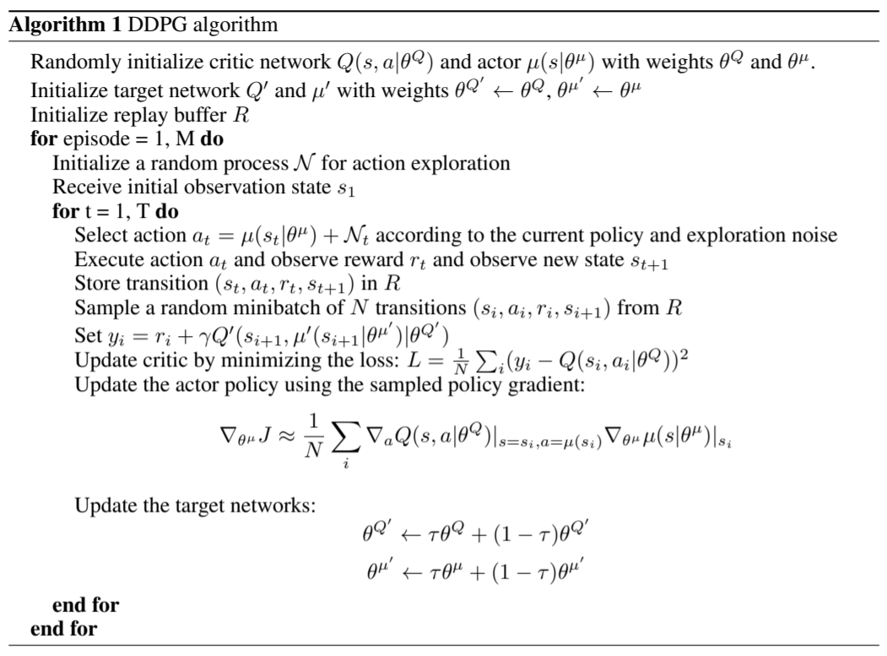

# Report
In this project, the method DDPG is implemented to control 20 robotic arms to follow a sphere.

## DDPG
The Deep Deterministic Policy Gradient (DDPG) algorithm was introduced in this paper: [Continuous Control With Deep Reinforcement Learning](https://arxiv.org/pdf/1509.02971.pdf)
The authors present the method as "a model-free, off-policy actor-critic algorithm using deep function approximators that can learn policies in high-dimensional, continuous action spaces".



The implementation of DDPG was initialized from the DDPG implementaiton in [Udacity Deep RL Github](https://github.com/udacity/deep-reinforcement-learning) **ddpg_pendulum**.

## Hyper parameters
```python
BUFFER_SIZE = int(1e5)  # replay buffer size
BATCH_SIZE = 128        # minibatch size
GAMMA = 0.99            # discount factor
TAU = 1e-3              # for soft update of target parameters
LR_ACTOR = 1e-3         # learning rate of the actor 
LR_CRITIC = 1e-4        # learning rate of the critic
WEIGHT_DECAY = 0.0      # L2 weight decay
theta=0.15              # Ornstein-Uhlenbeck noise parameter mean
sigma=0.1               # Ornstein-Uhlenbeck noise parameter std
```
